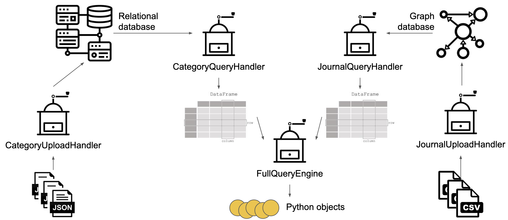
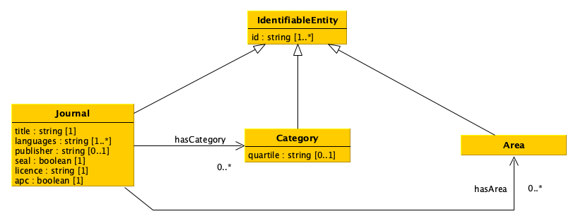
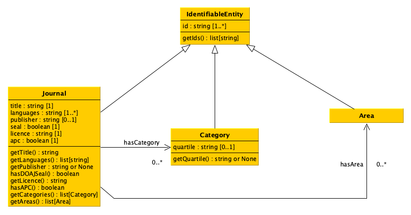
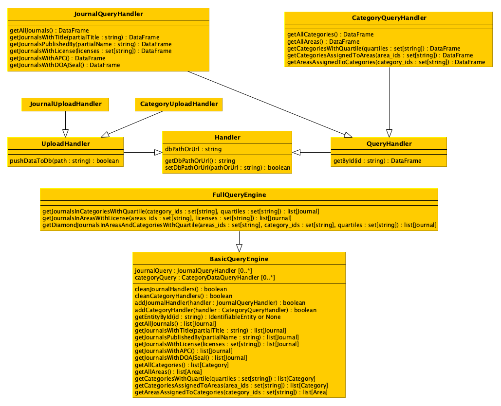

# 🤖 Data Science Project

Welcome to this little corner of data, code, and curiosity ✨  
This project was developed for the 2024/25 [Data Science course](https://www.unibo.it/en/teaching/course-unit-catalogue/course-unit/2024/467046) exam taught by [Silvio Peroni](https://www.unibo.it/sitoweb/silvio.peroni) in the [Digital Humanities and Digital Knowledge MA's degree](https://corsi.unibo.it/2cycle/DigitalHumanitiesKnowledge) at the [University of Bologna](http://www.unibo.it/en) and focuses on data processing, querying, and integration using Python.

Click [**HERE**](https://github.com/comp-data/2024-2025/tree/main/docs/project) for the project information!

-:-
## 🧠 Project Overview

This project explores:  

📊 Data collection and cleaning
|🗄️ Structured data (CSV, JSON, databases)
|🔍 Query engines and query handlers
|🧪 Integration of multiple data sources

**The goal of the project is to develop a software that enables one to process data stored in different formats and to upload them into two distinct databases to query these databases simultaneously according to predefined operations.**

-:-
## 🧩 UML Diagrams Gallery

Visual overview of the system architecture and class relationships 

<table align="center">
  <tr>
    <td align="center">
       
      <b>Workflow</b>
    </td>
    <td align="center">
       
      <b>Data Model</b>
    </td>
    <td align="center">
       
      <b>Data Model Classes</b>
    </td>
    <td align="center">
       
      <b>Additional Classes</b>
    </td>
  </tr>
</table>

-:-
# The Team: *PassiveIncomeSquad*

 <a href="https://github.com/claudiarom"><b>Claudia Romanello</b></a> &nbsp;•&nbsp;
 <a href="https://github.com/Fahmyrose"><b>Fahmida Islam</b></a> &nbsp;•&nbsp;
 <a href="https://github.com/ChenQingHa"><b>QingHao Chen</b></a> &nbsp;•&nbsp;
 <a href="https://github.com/polinakhrm"><b>Polina Khromtcova</b></a> 

